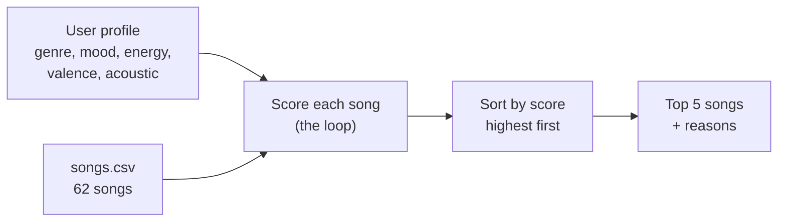

# 🎵 Music Recommender Simulation

## Project Summary

In this project you will build and explain a small music recommender system.

Your goal is to:

- Represent songs and a user "taste profile" as data
- Design a scoring rule that turns that data into recommendations
- Evaluate what your system gets right and wrong
- Reflect on how this mirrors real world AI recommenders

My version recommends songs based on the *vibe* of the music, not just the genre. You tell it what kind of music you like (your favorite genre, your mood, how much energy you want, and whether you want happy or sad songs), and it gives every song a score. The songs with the highest scores are your recommendations, and each one comes with a short reason why it was picked.

---

## How The System Works

### How real apps do it

Apps like Spotify and YouTube mostly learn from what people *do*. They track what you play, skip, save, replay, and add to playlists. Then they look for other people who listen like you and suggest songs those people love that you haven't heard yet. This is called **collaborative filtering**. They also look at the songs themselves, such as how fast, loud, happy, or acoustic a song sounds, and suggest songs that sound like the ones you already like. This is called **content-based filtering**. Big apps mix both, because each one covers the other's weak spots. For example, a brand new song has no plays yet, so only its sound can be used to recommend it.

### What my version does

My recommender only uses **content-based filtering**, because my data has song details but no listening history from real users. The main idea behind my design is that **energy is what makes a song feel chill or hype, not the genre**. A slow, laid-back rap song feels chill to me even though rap is usually called a high-energy genre. I also think a sad acoustic song and a happy acoustic song feel completely different, so my system checks how happy or sad a song sounds (valence) too.

### Features each `Song` uses

- `genre`: the style of music (pop, afrobeats, hip hop, folk, and more)
- `mood`: a simple label for the feeling (chill, happy, sad, intense, and more)
- `energy`: how intense the song feels, from 0 (very calm) to 1 (very intense)
- `valence`: how happy the song sounds, from 0 (sad) to 1 (happy)
- `acousticness`: how acoustic the song is, from 0 (electronic) to 1 (acoustic)

The data also has `tempo_bpm` and `danceability`, but I don't use them in the score. In this dataset they mostly go up and down with energy, so they would just count the same thing twice.

### What the `UserProfile` stores

- `favorite_genre`: the genre the user likes most
- `favorite_mood`: the mood they want right now
- `target_energy`: how much energy they want (0 to 1)
- `target_valence`: how happy or sad they want the music (0 to 1). This one is optional.
- `likes_acoustic`: whether they prefer acoustic songs (yes or no)

### My taste profile

This is the profile I'm using to test the system. It's someone who likes laid-back rap:

```python
user_prefs = {
    "favorite_genre": "hip hop",
    "favorite_mood": "chill",
    "target_energy": 0.35,
    "target_valence": 0.5,
    "likes_acoustic": False,
}
```

I checked if this profile can tell "intense rock" apart from "chill lofi". It can: *Storm Runner* (intense rock) scores 5.60, while *Library Rain* (chill lofi) scores 8.84. The energy and mood rules do most of that work.

### How a song gets its score

Every song starts at 0 and earns points:

| Rule | Points |
|---|---|
| Energy is close to what the user wants | up to 4.0 |
| Valence is close to what the user wants | up to 3.0 |
| Mood matches | +2.0 |
| Genre matches | +1.5 |
| Acousticness fits what the user likes | up to 1.0 |

For energy and valence, the song gets more points the **closer** it is to what the user wants. It does not get more points just for having a bigger number. The math is `1 - |song value - user target|`. So if you want energy 0.4, a song at 0.4 gets full points, a song at 0.6 gets a bit less, and a song at 0.9 gets a lot less. Energy gets the most points because it matters most to me. Genre gets the fewest because two songs from different genres can still share the same vibe.

### How songs are picked

1. Score every song in the list using the rules above.
2. Sort the songs from highest to lowest score.
3. Return the top songs (5 by default) along with the reasons each one scored well.

Scoring decides how good one song is for you. Ranking compares all the songs and picks the best ones. Keeping these two steps separate means I can change the points without breaking the sorting, or change how songs are picked without touching the math.

### Extra features (optional extensions)

- **Scoring modes:** I can switch between 4 sets of points with `--mode`. *Balanced* is my main recipe. *Genre-first* is for people who stick to one genre. *Mood-first* is for matching a feeling. *Energy-focused* is for workouts or sleep, where intensity is all that matters.
- **Diversity penalty:** with `--diverse`, a song loses 2 points if its artist is already in the list, and 1 point if there are already 2 songs from its genre. This keeps the top 5 from being all one artist.
- **5 more song details:** popularity (0 to 100), release decade, mood tags (like "euphoric" or "nostalgic"), speechiness (how much rapping or talking), and instrumentalness (how much of the song has no vocals). These only count if the user asks for them, like in the "Afrobeats Night Out" profile.
- **Table output:** results print as a table with the song, genre and mood, score, and every reason.

### Data flow



### Why I didn't use the starter weights

The course suggests +2.0 for genre, +1.0 for mood, plus points for energy. I tried that with my taste profile, and it put *Crown Up* (an intense, 0.88 energy rap song) in my top 5 just because it's hip hop. That's not what a chill listener wants. With my weights, the top 5 are all chill songs: *Late Night Verses*, *Sunday Sheets*, *Drift Current*, *Library Rain*, and *Midnight Coding*.

### Biases I expect

- **Energy might matter too much.** A song with the perfect energy can beat a song that matches both genre and mood. This could push songs from genres the user doesn't like.
- **Some moods have way more songs than others.** There are 14 sad songs but only 3 romantic and 3 angry ones, so some users get a lot more choice than others.
- **Exact word matching is strict.** "hip hop" and "drill" count as totally different genres, and "chill" and "relaxed" count as different moods, even though they're close.
- **One favorite genre and one mood only.** Real people like lots of things, and their mood changes during the day.
- **The song numbers are estimates.** The songs and their values were made up with AI help, based on what each genre usually sounds like. They aren't measured from real audio.
- **No surprises.** The system only finds songs like what you already said you like. It can't find something new you'd love, like collaborative filtering can.

---

## Getting Started

### Setup

1. Create a virtual environment (optional but recommended):

   ```bash
   python -m venv .venv
   source .venv/bin/activate      # Mac or Linux
   .venv\Scripts\activate         # Windows
   ```

2. Install dependencies

```bash
pip install -r requirements.txt
```

3. Run the app:

```bash
python -m src.main
```

You can also change how it runs:

```bash
python -m src.main --mode genre-first        # modes: balanced, genre-first, mood-first, energy-focused
python -m src.main --diverse                 # don't repeat artists, and limit songs from one genre
python -m src.main --profile "Chill Lofi"    # only show one profile
```

### Running Tests

Run the starter tests with:

```bash
pytest
```

You can add more tests in `tests/test_recommender.py`.

---

## Sample Recommendation Output

Here is what the recommender prints when you run `python -m src.main`. These are two of the 9 profiles. The rest are in the [model card](model_card.md#7-evaluation).

```
Loaded songs: 62
Mode: balanced - My main recipe: energy first, then valence, mood, genre

Profile: High-Energy Pop   (mode: balanced)
  favorite_genre=pop, favorite_mood=happy, target_energy=0.85, target_valence=0.8,
  likes_acoustic=False
+---+------------------+--------------+-------+-----------------------------------+
| # | Song             | Genre / Mood | Score | Why                               |
+---+------------------+--------------+-------+-----------------------------------+
| 1 | Sunrise City     | pop          | 11.08 | energy 0.82 vs your 0.85 (+3.88)  |
|   | by Neon Echo     | happy        |       | valence 0.84 vs your 0.80 (+2.88) |
|   |                  |              |       | mood match: happy (+2.00)         |
|   |                  |              |       | genre match: pop (+1.50)          |
|   |                  |              |       | not acoustic fit (+0.82)          |
+---+------------------+--------------+-------+-----------------------------------+
| 2 | Calor Total      | reggaeton    | 9.54  | energy 0.82 vs your 0.85 (+3.88)  |
|   | by Fuego Sur     | happy        |       | valence 0.88 vs your 0.80 (+2.76) |
|   |                  |              |       | mood match: happy (+2.00)         |
|   |                  |              |       | not acoustic fit (+0.90)          |
+---+------------------+--------------+-------+-----------------------------------+
| 3 | Open Highway     | rock         | 9.40  | energy 0.80 vs your 0.85 (+3.80)  |
|   | by Steel Avenue  | happy        |       | valence 0.75 vs your 0.80 (+2.85) |
|   |                  |              |       | mood match: happy (+2.00)         |
|   |                  |              |       | not acoustic fit (+0.75)          |
+---+------------------+--------------+-------+-----------------------------------+
| 4 | Island Bounce    | dancehall    | 9.37  | energy 0.74 vs your 0.85 (+3.56)  |
|   | by Yard Vibes    | happy        |       | valence 0.83 vs your 0.80 (+2.91) |
|   |                  |              |       | mood match: happy (+2.00)         |
|   |                  |              |       | not acoustic fit (+0.90)          |
+---+------------------+--------------+-------+-----------------------------------+
| 5 | Rooftop Lights   | indie pop    | 9.26  | energy 0.76 vs your 0.85 (+3.64)  |
|   | by Indigo Parade | happy        |       | valence 0.81 vs your 0.80 (+2.97) |
|   |                  |              |       | mood match: happy (+2.00)         |
|   |                  |              |       | not acoustic fit (+0.65)          |
+---+------------------+--------------+-------+-----------------------------------+

Profile: Chill Hip Hop (mine)   (mode: balanced)
  favorite_genre=hip hop, favorite_mood=chill, target_energy=0.35, target_valence=0.5,
  likes_acoustic=False
+---+-------------------+--------------+-------+-----------------------------------+
| # | Song              | Genre / Mood | Score | Why                               |
+---+-------------------+--------------+-------+-----------------------------------+
| 1 | Late Night Verses | hip hop      | 11.02 | energy 0.38 vs your 0.35 (+3.88)  |
|   | by Kay Mellow     | chill        |       | valence 0.52 vs your 0.50 (+2.94) |
|   |                   |              |       | mood match: chill (+2.00)         |
|   |                   |              |       | genre match: hip hop (+1.50)      |
|   |                   |              |       | not acoustic fit (+0.70)          |
+---+-------------------+--------------+-------+-----------------------------------+
| 2 | Sunday Sheets     | pop          | 8.95  | energy 0.40 vs your 0.35 (+3.80)  |
|   | by Mira Vale      | chill        |       | valence 0.65 vs your 0.50 (+2.55) |
|   |                   |              |       | mood match: chill (+2.00)         |
|   |                   |              |       | not acoustic fit (+0.60)          |
+---+-------------------+--------------+-------+-----------------------------------+
| 3 | Drift Current     | liquid dnb   | 8.90  | energy 0.50 vs your 0.35 (+3.40)  |
|   | by Glass Harbor   | chill        |       | valence 0.60 vs your 0.50 (+2.70) |
|   |                   |              |       | mood match: chill (+2.00)         |
|   |                   |              |       | not acoustic fit (+0.80)          |
+---+-------------------+--------------+-------+-----------------------------------+
| 4 | Library Rain      | lofi         | 8.84  | energy 0.35 vs your 0.35 (+4.00)  |
|   | by Paper Lanterns | chill        |       | valence 0.60 vs your 0.50 (+2.70) |
|   |                   |              |       | mood match: chill (+2.00)         |
|   |                   |              |       | not acoustic fit (+0.14)          |
+---+-------------------+--------------+-------+-----------------------------------+
| 5 | Midnight Coding   | lofi         | 8.83  | energy 0.42 vs your 0.35 (+3.72)  |
|   | by LoRoom         | chill        |       | valence 0.56 vs your 0.50 (+2.82) |
|   |                   |              |       | mood match: chill (+2.00)         |
|   |                   |              |       | not acoustic fit (+0.29)          |
+---+-------------------+--------------+-------+-----------------------------------+
```

---

## Experiments You Tried

I tested 9 user profiles (4 normal ones, 4 tricky edge cases, and 1 that uses the extra song details). I also ran 2 experiments on the weights and tried out the scoring modes and the diversity penalty. The full write-up is in the [model card](model_card.md#7-evaluation).

- **Doubled energy (4.0 to 8.0) and cut genre in half (1.5 to 0.75):** Mostly the same songs came back in a slightly different order. The results were different, not better. For a "high energy but sad" listener it got worse, because angry metal songs started showing up instead of sad songs.
- **Turned off the mood rule:** This made things clearly worse. *Gym Hero*, a pop workout song that's intense, not happy, jumped to #2 for a happy pop fan. Sad and hype rap songs also got into my chill hip hop list. Mood is doing a lot of the work.
- **Scoring modes:** Genre-first mode fixed my rock fan problem (4 of 5 songs became rock), but it made things worse for the pop fan, who started getting sad and intense pop songs. No one mode is best for everyone.
- **Diversity penalty:** For the metal fan, it removed a second song by the same band and let a jazz song in. Most profiles didn't change, because they already had different artists.
- **Different users:** A happy pop fan and a chill lofi fan got no songs in common, which makes sense since they want opposite energy. A chill lofi fan and a chill hip hop fan got almost the same list, because they want the same vibe.

---

## Limitations and Risks

- **Genre fans get mixed results.** Genre is worth only 1.5 points, so a rock fan got drill, dancehall, and hip hop songs in their top 5 just because those songs had the right energy.
- **Capital letters break it.** Typing "Hip Hop" instead of "hip hop" makes the genre and mood checks fail without any warning.
- **The acoustic preference barely does anything.** It's worth so little that an "acoustic metal" fan still got all-electric songs.
- **Small, uneven catalog.** Only 62 made-up songs, with 14 sad songs but only 3 romantic ones.
- **It doesn't understand lyrics, language, or what you've listened to before.**

---

## Reflection

Read my full [**Model Card**](model_card.md) for the details.

Building this showed me that a recommender is really just a way of turning "what you like" into numbers, and then comparing those numbers to every song. My version gives each song points for being close to the energy, mood, and sound you want, and the songs with the most points win. Even though it's simple math, the results felt like real recommendations, mostly because each song comes with its reasons. Real apps like Spotify do something bigger. They learn from millions of people's plays and skips, instead of a few rules that I picked by hand.

The part that made me think the most was bias. Every weight I chose decided whose taste counts more. I put energy first because that's how I listen, but that made the system worse for someone who only listens to rock. The data had bias too: there are 14 sad songs but only 3 romantic ones, so some listeners just get more choices. Even small things like capital letters made the system quietly ignore what someone asked for. In a real app with millions of users, these small choices would decide which artists get heard and which ones get buried.
